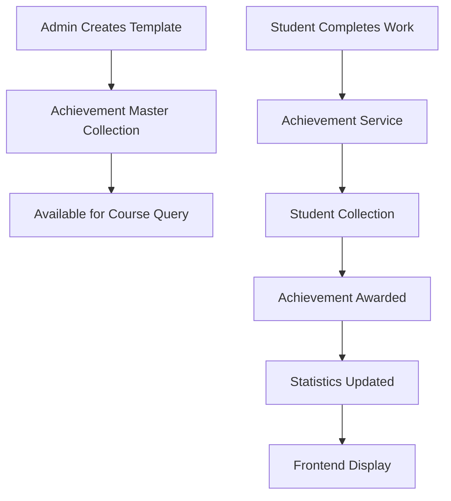

# 🏆 Achievement System Architecture

## 📋 **Overview**

El sistema de logros de RavenCode está estructurado en **dos niveles principales**:

1. **🎯 Achievement Templates (Master)** - Definiciones de logros que pueden ser obtenidos
2. **👤 Student Achievements** - Logros específicos obtenidos por cada estudiante

---

## 📂 **File Structure**

```
app/
├── models/
│   ├── achievement.py      # 🎯 Achievement models & interfaces
│   ├── student.py         # 👤 Student model (clean, focused)
│   └── diploma.py         # 🎓 Diploma models (separate concern)
├── services/
│   ├── achievement_service.py         # 👤 Student achievement operations
│   ├── achievement_master_service.py  # 🎯 Achievement template management
│   └── diploma_service.py            # 🎓 Diploma operations
└── api/
    ├── achievements.py    # 🚀 Achievement API endpoints
    └── diplomas.py       # 🎓 Diploma API endpoints
```

---

## 🎯 **Achievement Templates (Master Collection)**

### Purpose
Defines **what achievements can be earned** across all courses.

### Collection: `achievements_master`

### Structure:
```json
{
  "id": "uuid",
  "achievement_name": "first_lesson_completed",
  "course_id": "python-101",
  "title": "Primera Lección Completada",
  "description": "Has completado tu primera lección",
  "max_points": 100.0,
  "requirements": ["Complete lesson 1", "Score > 80%"],
  "metadata": {
    "category": "learning",
    "rarity": "common",
    "xp_reward": 100,
    "difficulty": "beginner"
  },
  "created_at": "2025-01-21T...",
  "updated_at": "2025-01-21T...",
  "active": true
}
```

### Key Features:
- ✅ **One template per achievement per course**
- ✅ **Defines requirements and constraints**
- ✅ **Metadata includes category, rarity, XP rewards**
- ✅ **Soft delete with `active` flag**
- ✅ **Admin management via API**

---

## 👤 **Student Achievements (Individual Records)**

### Purpose
Tracks **which achievements each student has earned** and their progress.

### Collection: `students`

### Structure:
```json
{
  "email": "student@example.com",
  "achievements": [
    {
      "id": "uuid",
      "email": "student@example.com",
      "achievement_name": "first_lesson_completed",
      "course_id": "python-101",
      "title": "Primera Lección Completada",
      "description": "Has completado tu primera lección",
      "score": 85.0,
      "total_points": 100.0,
      "percentage": 85.0,
      "date_earned": "2025-01-21T...",
      "status": "completed",
      "achieved": true,
      "metadata": {
        "category": "learning",
        "rarity": "common",
        "xp_reward": 100,
        "difficulty": "beginner"
      }
    }
  ],
  "total_xp": 350,
  "created_at": "2025-01-21T...",
  "updated_at": "2025-01-21T..."
}
```

### Key Features:
- ✅ **Links achievement to specific user**
- ✅ **Tracks score, percentage, date earned**
- ✅ **Auto-calculates achievement status**
- ✅ **Inherits template data but can override**
- ✅ **Supports progress tracking**

---

## 🚀 **API Endpoints**

### **Student Achievement Operations**
```
POST   /achievements/update              # Create/update student achievement
GET    /achievements/{email}             # Get all achievements for student
GET    /achievements/{email}/stats       # Get achievement statistics
POST   /achievements/bulk-update         # Update multiple achievements
DELETE /achievements/{email}/{name}      # Delete specific achievement
```

### **Achievement Template Management**
```
POST   /achievements/templates           # Create achievement template
GET    /achievements/templates           # Get all templates (admin)
GET    /achievements/course/{id}/available  # Get available achievements for course
```

### **Admin Operations**
```
GET    /admin/achievements               # Get all student achievements
GET    /admin/achievements/user/{email}  # Get user achievements (admin view)
POST   /admin/achievements/create        # Create achievement for user (admin)
```

---

## 🔄 **Workflow Example**

### 1. **Setup Phase (Admin)**
```bash
# Create achievement template
POST /achievements/templates
{
  "achievement_name": "python_basics",
  "course_id": "python-101",
  "title": "Python Basics Master",
  "description": "Mastered Python fundamentals",
  "max_points": 100,
  "requirements": ["Complete 5 lessons", "Score > 80%"],
  "metadata": {
    "category": "learning",
    "rarity": "common",
    "xp_reward": 150
  }
}
```

### 2. **Student Progress**
```bash
# Student completes work, API awards achievement
POST /achievements/update
{
  "email": "student@example.com",
  "achievement": {
    "achievement_name": "python_basics",
    "course_id": "python-101",
    "title": "Python Basics Master",
    "description": "Mastered Python fundamentals"
  },
  "score": 87,
  "total_points": 100
}
```

### 3. **Frontend Queries**
```bash
# Get student's achievements
GET /achievements/student@example.com

# Get available achievements for course
GET /achievements/course/python-101/available

# Get statistics
GET /achievements/student@example.com/stats
```

---

## 📊 **Data Flow**



---

## 🎯 **Key Benefits**

### ✅ **Separation of Concerns**
- Templates define "what can be earned"
- Student records track "what was earned"

### ✅ **Frontend Compatibility**
- Exact TypeScript interface matching
- Standardized response formats
- Comprehensive metadata support

### ✅ **Scalability**
- Templates shared across students
- Efficient queries and aggregations
- Easy to add new achievement types

### ✅ **Admin Control**
- Full template management
- Bulk operations support
- Comprehensive monitoring

### ✅ **Data Integrity**
- Validates against templates
- Prevents invalid achievements
- Consistent data structure

---

## 🛠️ **Development Notes**

### **Adding New Achievement Types**
1. Create template via `/achievements/templates`
2. Set proper metadata (category, rarity, XP)
3. Define requirements clearly
4. Test with student progress

### **Modifying Existing Achievements**
1. Update template (affects future awards)
2. Consider migration for existing student records
3. Maintain backward compatibility

### **Performance Considerations**
- Templates collection is relatively small
- Student collections indexed by email
- Use aggregation for statistics
- Cache frequently accessed templates

---

## 🎉 **Ready for Frontend!**

The API now provides:
- ✅ **Exact TypeScript interface matching**
- ✅ **Comprehensive achievement metadata**
- ✅ **Efficient template management** 
- ✅ **Admin and student operations**
- ✅ **Statistics and progress tracking**

**Documentation**: http://localhost:8003/docs 